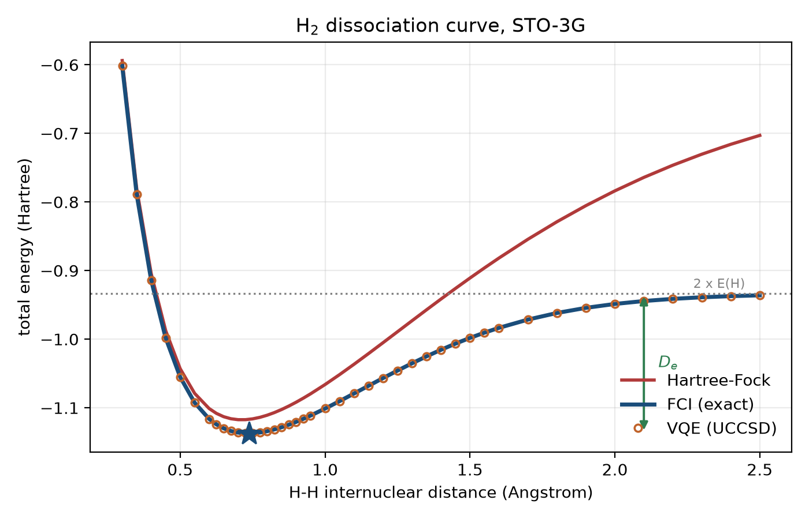
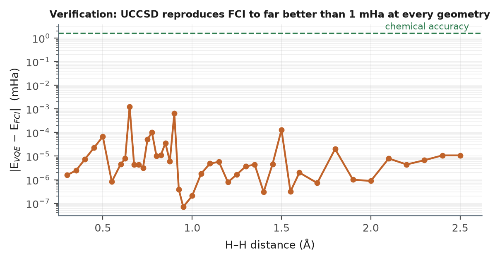
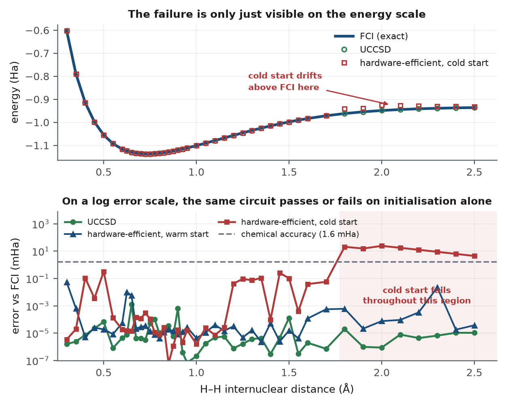
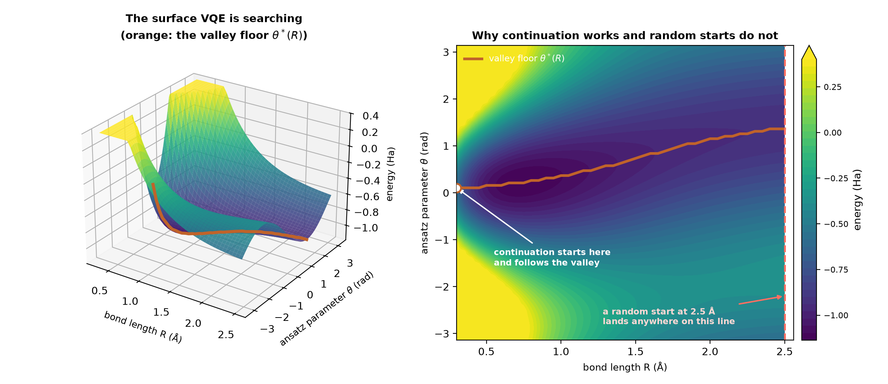

# H₂ Potential Energy Surface with VQE

Mapping the bond dissociation curve of the hydrogen molecule with a
Variational Quantum Eigensolver, verified against exact diagonalisation at
every geometry.

Built end to end: nuclear geometry → molecular integrals → fermionic
Hamiltonian → qubit Hamiltonian → variational solution → physical
observables. No hardcoded Pauli coefficients anywhere.



---

## What this does and does not claim

For H₂ in a minimal STO-3G basis, VQE with a UCCSD ansatz reproduces the
exact full-configuration-interaction result for that basis. **The quantum
algorithm gives you nothing a classical solver cannot produce in
milliseconds.** That is expected and it is the point.

The deliverable is not quantum advantage. It is a *verified implementation*:
the VQE curve and the exact curve lie on top of one another to within
**0.0013 mHa** at every one of 43 geometries — roughly a thousand times
tighter than chemical accuracy.

---

## Results

All numbers produced by this repository, reproducible with `make all`.

### Verification against exact diagonalisation

| | Value |
|---|---|
| Max \|E_VQE − E_FCI\| across the scan | **0.0013 mHa** |
| Chemical accuracy threshold | 1.6 mHa |
| Correlation energy recovered at R_e | 100.0000 % |
| Geometries scanned | 43 (0.30 – 2.50 Å) |



### Physical observables

| Quantity | This work | Experiment | Error |
|---|---|---|---|
| Equilibrium bond length R_e | 0.7367 Å | 0.7414 Å | −0.63 % |
| Well depth D_e | 5.556 eV | 4.747 eV | +17.1 % |
| Harmonic frequency ω | 5184 cm⁻¹ | 4401 cm⁻¹ | +17.8 % |

The bond length is good; the energetics are not. That is the basis set, not
the algorithm — a minimal basis is a deliberately impoverished description of
the electronic structure. **The VQE reproduced FCI exactly; FCI/STO-3G simply
is not a good model of reality.** Both statements are true and neither
undermines the other. Change `basis="sto-3g"` to `"6-31g"` and the
disagreement shrinks.

### Extension: where a hardware-efficient ansatz stops working

The same scan run with a generic hardware-efficient circuit (the PennyLane
equivalent of Qiskit's `TwoLocal`) instead of UCCSD, holding the Hamiltonian,
optimiser and reference state fixed.

| Condition | Parameters | Max error | Geometries above chemical accuracy |
|---|---|---|---|
| UCCSD, warm-started | 3 | 0.0013 mHa | 0 / 43 |
| Hardware-efficient (2 reps), warm-started | 24 | 0.054 mHa | 0 / 43 |
| Hardware-efficient (2 reps), **cold-started** | 24 | **24.10 mHa** | **8 / 43** |
| Hardware-efficient (4 reps), cold-started | 40 | 0.098 mHa | 0 / 43 |



The cold-started shallow circuit fails at every geometry from **1.80 Å**
outward — exactly the strongly-correlated region where Hartree–Fock diverges.

**Why it fails is the interesting part.** At 2.5 Å, thirty random restarts
find thirteen distinct minima and never reach chemical accuracy (best
2.19 mHa). That looks like proof of an expressibility limit. It is not:

| Same circuit, same geometry, 24 parameters | Best energy | Error vs FCI |
|---|---|---|
| 30 cold starts, random initialisation | −0.933866 Ha | 2.189 mHa |
| 1 warm start, continued along the curve | −0.936055 Ha | **0.0000 mHa** |

The solution was inside the circuit's reach the whole time. The failure is
entirely the optimisation landscape and where you enter it. Random restarts
bound what random *search* finds, not what a circuit can *express* — so
`diagnose()` runs the continuation control alongside the restart study.

Depth tells the same story: three and four repetitions let cold starts
succeed, but six is *worse* than four. More parameters make the landscape
harder to search faster than the extra freedom helps.

### The landscape itself

The dissociation curve is energy against one variable, so it is a curve.
There is a genuine surface here though — energy as a function of *both* the
geometry and the circuit's tuning parameter — and it shows why the result
above comes out the way it does.



The valley floor drifts smoothly from θ* = 0.105 rad at 0.30 Å to 1.361 rad
at 2.50 Å. Continuation enters that valley where the problem is easy and
rides it out to full dissociation. A random start at 2.5 Å is a blind guess
somewhere along the vertical line, with no reason to land near θ* = 1.36.

Run it with `python landscape.py` (~25 s).

**Interactive version.** [`results/interactive/landscape_3d.html`](results/interactive/landscape_3d.html)
renders the same surface in WebGL — orbit it, walk the continuation path, and
fire random starts to watch them miss. Self-contained: three.js and the grid
are inlined, so it needs no server and makes no external requests. Rebuild it
after a fresh scan with:

```bash
python landscape.py
python results/interactive/export.py
python results/interactive/build.py
```

---

## Quick start

```bash
git clone https://github.com/aanyaloyalka307/POTENTIAL-ENERGY-SURFACE-MAPPER.git
cd POTENTIAL-ENERGY-SURFACE-MAPPER
make setup      # create .venv, install pennylane + pyscf + friends
make verify     # prove the stack reproduces known energies
make test       # run the test suite
make scan       # the geometry scan, ~2 min
make analyse    # extract observables, write the figure
```

Or without `make`:

```bash
python3 -m venv .venv && source .venv/bin/activate
pip install -r requirements.txt
python verify_env.py
```

Verified on Python 3.14.4 with PennyLane 0.45.1 and PySCF 2.14.0; CI runs
3.11 and 3.12.

---

## Repository layout

Modules sit at the repository root, and each maps one-to-one onto a phase of
the accompanying roadmap in [`docs/`](docs).

| File | Phase | What it does |
|---|---|---|
| `verify_env.py` | 0 | Proves the stack works by computing three known energies |
| `classical.py` | 1 | Hartree–Fock and FCI references from PySCF |
| `anticommute_demo.py` | 2 | Eight lines showing why the naive qubit encoding fails |
| `hamiltonian.py` | 2 | Bond length → qubit Hamiltonian; mappings; symmetry tapering |
| `vqe_single.py` | 3 | UCCSD ansatz and the optimiser loop at one geometry |
| `scan.py` | 4 | The loop over bond length, with warm-starting |
| `analyse.py` | 5 | Fitting, observables, and the three-curve figure |
| `compare_ansatz.py` | 6 | UCCSD vs hardware-efficient, and the failure diagnostic |
| `landscape.py` | 6 | The E(R, θ) surface behind the Phase 6 result |

`docs/` contains seven PDFs — one per phase — covering the theory, a
step-by-step build guide, and the traps, at about 78 pages total.

---

## Reference values (STO-3G)

Properties of the physics, not of the software. If yours differ, something is
wrong. `tests/test_physics.py` asserts all of them.

| Quantity | Value |
|---|---|
| Hartree–Fock at 0.735 Å | −1.116999 Ha |
| FCI at 0.735 Å | −1.137306 Ha |
| Nuclear repulsion at 0.735 Å | 0.719969 Ha |
| Correlation energy | 0.020307 Ha (0.553 eV) |
| Qubits / Pauli terms (Jordan–Wigner) | 4 / 15 |
| Qubits / terms after full tapering | 1 / 3 |
| Dissociation limit, 2 × E(H) | −0.933164 Ha |

---

## Three things that are easy to get wrong

Documented at length in `docs/`, and each has a regression test.

**Bohr versus Ångström.** PennyLane's `qchem` defaults to Bohr; PySCF's
`gto.M` defaults to Ångström. This project uses both. The conversion happens
explicitly, in one place, in `hamiltonian.py`. Symptom of getting it wrong: a
minimum at a physically absurd distance, or no minimum at all.

**Nuclear repulsion.** At fixed geometry it is a constant, so it is often
dropped — and then forgotten. But 1/R varies from 3.53 Ha at 0.3 Å to 0.42 Ha
at 2.5 Å. Omit it and there is no bond. Published two-qubit H₂ Hamiltonians
are frequently electronic-only; their ground state is −1.857 Ha, and adding
1/R = 0.720 Ha recovers the familiar −1.137 Ha.

**The last grid point is not the dissociation limit.** At 2.5 Å the curve is
still bound by 2.9 mHa. `analyse.py` computes 2 × E(H) analytically instead.

---

## Development record

[`CHANGELOG.md`](CHANGELOG.md) is the build log. It records four defects that
shipped before being caught — invented example output, two assertion
tolerances that fail when run, a grid documented as 43 points when the figures
were drawn from 44, and a conclusion that was wrong twice before it was right
— and how each was found.

---

## License

MIT — see [LICENSE](LICENSE).
